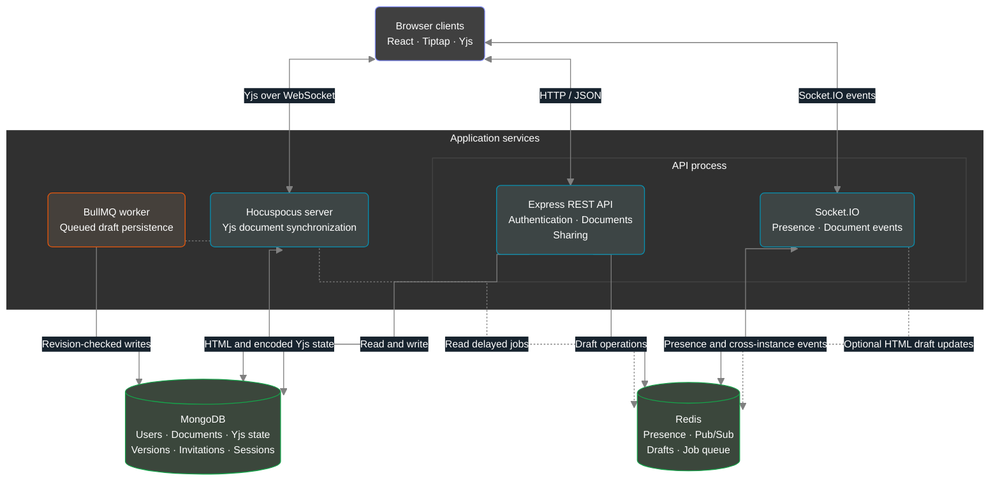

# CollabSpace

**Write together. Manage access. Keep a history.**

CollabSpace is a collaborative rich-text document editor built with React and Node.js. It combines live editing, document sharing, online presence, and version history in a workspace with separate services for collaboration and background persistence.

## High-Level Design



The editor sends live content changes through **Yjs and Hocuspocus**. **Socket.IO** carries presence, restoration, and permission-change events. The dotted path represents the additional Socket.IO HTML draft pipeline; the current editor uses Hocuspocus for content synchronization and persistence.

[Features](#features) · [How It Works](#how-it-works) · [Local Setup](#local-setup) · [API](#api-overview) · [Development](#development-and-checks)

## Features

- **Collaborative editing:** multiple users edit the same document with Yjs handling concurrent changes.
- **Rich-text tools:** headings, lists, task lists, links, tables, text alignment, colors, highlighting, and character counts.
- **Document workspace:** create, rename, search, and delete documents; browse owned, shared, recent, and starred documents.
- **Controlled sharing:** invite an existing user by email as an editor or viewer. Invitations appear inside the app for acceptance or rejection.
- **Online presence:** see who is connected to the current document, including connections across API instances.
- **Version history:** save snapshots, preview earlier content, and restore retained versions. The latest 30 versions are kept, with consecutive identical snapshots deduplicated.
- **Session management:** short-lived access tokens, rotating refresh tokens, protected routes, and automatic HTTP token refresh.
- **Responsive interface:** light and dark themes, a document dashboard, and an editor with collaboration controls.

Starred documents are stored per user in the current browser's local storage. They do not synchronize between devices.

## Technology Stack

| Layer | Technologies |
| --- | --- |
| Frontend | React 19, Vite 8, React Router, Tailwind CSS 4, Axios |
| Editor | Tiptap 3, Yjs, Hocuspocus provider |
| HTTP API | Node.js, Express 5, Mongoose |
| Live communication | Hocuspocus 3, Socket.IO 4, Socket.IO Redis adapter |
| Storage | MongoDB, Redis |
| Background jobs | BullMQ |
| Authentication | JWT, HTTP-only refresh cookies, scrypt password hashing |
| Checks | Node.js test runner, ESLint, Vite production build |

## How It Works

### Live collaboration

1. The browser loads document metadata and the user's role from the REST API.
2. Tiptap binds the editor to a local Yjs document and connects to Hocuspocus using an access token.
3. Hocuspocus verifies the user, document access, and collaboration session version. Viewer connections are read-only.
4. Yjs updates synchronize between collaborators. Hocuspocus stores both rendered HTML and encoded Yjs state in MongoDB, with a 250 ms debounce and a 1 second maximum debounce.
5. A separate Socket.IO connection joins the document room to receive presence and document lifecycle events.

Permissions are rechecked when collaboration messages arrive and periodically for connected users. Removing access closes the affected collaboration connection; changing an editor to a viewer makes the connection read-only.

### Saving and restoring versions

Live persistence and saved history serve different purposes. Hocuspocus automatically persists the evolving document. The explicit **Save** action first waits for a persistence acknowledgement from Hocuspocus, then calls the REST API to create a history snapshot.

Snapshot creation uses a MongoDB transaction to coordinate version numbering, duplicate prevention, and retention. Restoring a version replaces the current content and increments the collaboration session version. Clients reconnect to the new room, and writes from an older room cannot overwrite the restored document.

Leaving the editor without explicitly saving does not roll back changes already synchronized and persisted by Hocuspocus.

### Redis and background saves

Redis supports the Socket.IO adapter, presence records, authentication rate limits, temporary HTML drafts, and the BullMQ queue.

The backend also accepts `document-change` Socket.IO events for HTML drafts. These updates are buffered in Redis and schedule a save after three minutes without another update. A separate worker writes eligible drafts to MongoDB. Revision checks prevent queued drafts from overwriting newer restore/save state, and the worker avoids replacing documents that already have persisted Yjs state.

This draft queue is a separate backend path; normal typing in the current Tiptap editor is persisted by Hocuspocus.

## Access Model

| Action | Owner | Editor | Viewer |
| --- | :---: | :---: | :---: |
| Read a document and view presence | Yes | Yes | Yes |
| View version history | Yes | Yes | Yes |
| Edit content and rename | Yes | Yes | No |
| Save snapshots and restore versions | Yes | Yes | No |
| Invite users and manage collaborator roles | Yes | No | No |
| Delete the document | Yes | No | No |

Invitation acceptance updates document access and invitation status in a transaction. Sharing requires the recipient to have a registered account; the application does not send invitation emails.

## Local Setup

### Prerequisites

- Node.js **22.13+ within the 22.x line, or 24+**, and npm, to satisfy the included frontend tooling.
- A MongoDB database with transaction support: use **MongoDB Atlas or a local replica set**. A standalone MongoDB server will not support the invitation and version-history transactions.
- A running Redis instance.
- Git.

### 1. Clone and install

```bash
git clone https://github.com/Gnanasagar-Reddy/CollabSpace.git
cd CollabSpace
npm ci
npm ci --prefix backend
npm ci --prefix frontend
```

The root, backend, and frontend each have their own package file and lockfile.

### 2. Configure the backend

Create `backend/.env`:

```dotenv
PORT=5000
MONGO_URI=mongodb://127.0.0.1:27017/collabspace?replicaSet=rs0
REDIS_URL=redis://127.0.0.1:6379
JWT_ACCESS_SECRET=replace-with-a-random-access-secret
JWT_REFRESH_SECRET=replace-with-a-different-random-refresh-secret
CLIENT_ORIGIN=http://localhost:5173
COLLABORATION_PORT=1234
NODE_ENV=development
TRUST_PROXY=false
CROSS_SITE_COOKIES=false
```

The MongoDB example assumes a running replica set named `rs0`. Replace it with your own replica-set or Atlas connection string. Generate a different value for each JWT secret by running this command twice:

```bash
node -e "console.log(require('node:crypto').randomBytes(48).toString('hex'))"
```

### 3. Configure the frontend

Create `frontend/.env`:

```dotenv
VITE_API_URL=http://localhost:5000/api
VITE_SOCKET_URL=http://localhost:5000
VITE_COLLABORATION_URL=ws://localhost:1234
```

`VITE_API_URL` includes `/api`; `VITE_SOCKET_URL` is the API server's origin. The collaboration URL points to the separate Hocuspocus server. Restart Vite after changing these values.

### 4. Start the application

Start MongoDB and Redis, then run each command below in a separate terminal from the repository root:

```bash
# Terminal 1: HTTP API and Socket.IO
npm --prefix backend run dev
```

```bash
# Terminal 2: Yjs / Hocuspocus collaboration
npm --prefix backend run collaboration:dev
```

```bash
# Terminal 3: background draft worker
npm --prefix backend run worker:dev
```

```bash
# Terminal 4: frontend
npm --prefix frontend run dev
```

Open **http://localhost:5173**. The API health endpoint is **http://localhost:5000/health**.

## API Overview

Authentication routes are under `/api/auth`. Document routes are under `/api/documents` and require `Authorization: Bearer <accessToken>`.

| Method | Endpoint | Purpose |
| --- | --- | --- |
| POST | `/api/auth/register` | Create an account |
| POST | `/api/auth/login` | Sign in and set the refresh cookie |
| POST | `/api/auth/refresh-token` | Rotate the refresh token and issue an access token |
| POST | `/api/auth/logout` | Revoke the supplied refresh session and clear its cookie |
| GET | `/api/auth/me` | Read the authenticated user |
| GET / POST | `/api/documents` | List accessible documents / create a document |
| GET | `/api/documents/owned` | List owned documents |
| GET | `/api/documents/shared` | List documents shared with the user |
| GET / PUT / DELETE | `/api/documents/:id` | Read / update / delete a document |
| POST | `/api/documents/:id/share-request` | Invite an existing user |
| GET | `/api/documents/share-requests` | List received invitations |
| PATCH | `/api/documents/share-requests/:requestId/accept` | Accept an invitation |
| PATCH | `/api/documents/share-requests/:requestId/reject` | Reject an invitation |
| PATCH / DELETE | `/api/documents/:id/collaborators/:userId` | Change a role / remove access |
| POST | `/api/documents/:documentId/save` | Save a history snapshot |
| DELETE | `/api/documents/:documentId/draft` | Discard the Redis draft |
| GET | `/api/documents/:documentId/versions` | Read retained version history |
| POST | `/api/documents/:documentId/versions/:versionId/restore` | Restore a retained version |

Discarding a Redis draft does not undo CRDT changes already persisted by Hocuspocus. A CRDT client should confirm collaboration persistence before calling the snapshot endpoint, as the included frontend does.

## Project Structure

```text
CollabSpace/
├── backend/
│   ├── src/
│   │   ├── collaboration/      # Hocuspocus server and Yjs persistence
│   │   ├── config/             # MongoDB and Redis connections
│   │   ├── middleware/         # Authentication, errors, rate limits
│   │   ├── modules/
│   │   │   ├── auth/           # Users, login, refresh sessions
│   │   │   └── document/       # Documents, invitations, versions, access
│   │   ├── queue/              # BullMQ producer and worker
│   │   ├── services/           # Presence helpers
│   │   ├── socket/             # Socket.IO server and authentication
│   │   ├── utils/              # Passwords, JWTs, response helpers
│   │   ├── app.js              # Express middleware and routes
│   │   ├── server.js           # API process entry point
│   │   └── worker.js           # Worker process entry point
│   └── test/
├── frontend/
│   ├── src/
│   │   ├── components/         # Dashboard, editor, sharing controls
│   │   ├── context/            # Authentication state
│   │   ├── hooks/              # Documents, presence, invitations
│   │   ├── pages/              # Login, register, dashboard, editor
│   │   ├── routes/             # Public and protected routes
│   │   ├── services/           # Axios client and token refresh
│   │   ├── socket/             # Socket.IO client
│   │   └── utils/              # Save acknowledgement and UI helpers
│   └── test/
└── package.json                # Development process orchestration
```

## Deployment Notes

- Serve the frontend build and run the API, Hocuspocus server, and worker as separate processes. Provide persistent MongoDB and Redis services.
- Use HTTPS for the app/API and WSS for collaboration; the proxy must support WebSocket upgrades for both live channels.
- Set `CLIENT_ORIGIN` to the frontend origin and supply the frontend environment values when building. Enable `TRUST_PROXY=true` only for an appropriate one-proxy deployment.
- With `NODE_ENV=production`, refresh cookies require HTTPS. `CROSS_SITE_COOKIES=true` enables `SameSite=None` and secure cookies when the frontend and API require cross-site cookies.
- Access tokens expire after 15 minutes; refresh tokens expire after seven days and rotate on use. The frontend stores access tokens in local storage and refresh tokens in HTTP-only cookies.
- The Socket.IO Redis adapter supports events across API instances. Hocuspocus currently keeps active collaboration rooms in one process; it has no configured cross-instance collaboration adapter. Keep a single collaboration instance until shared room synchronization is added.
- `/health` reports that the API process responds; it does not actively probe database or Redis readiness.

## Author

Built by [Gnanasagar Reddy](https://github.com/Gnanasagar-Reddy).
